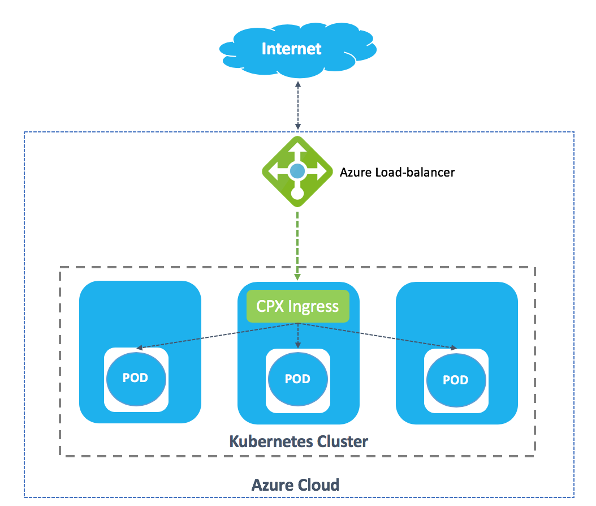
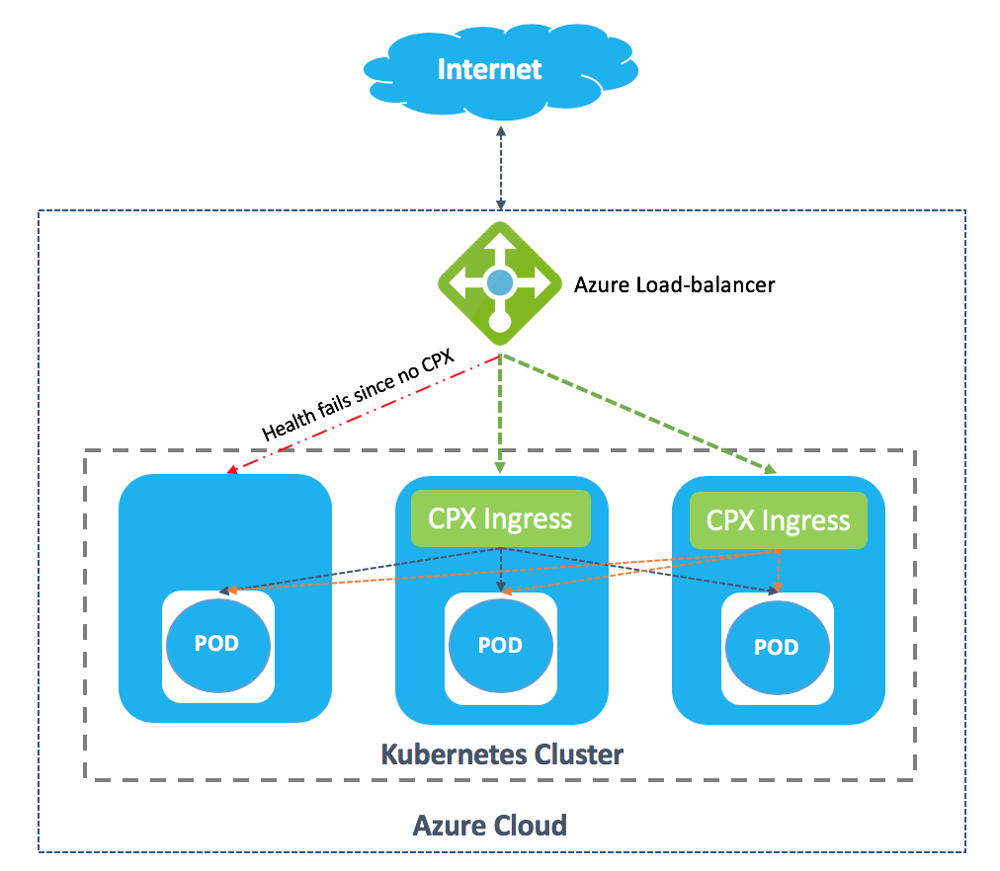
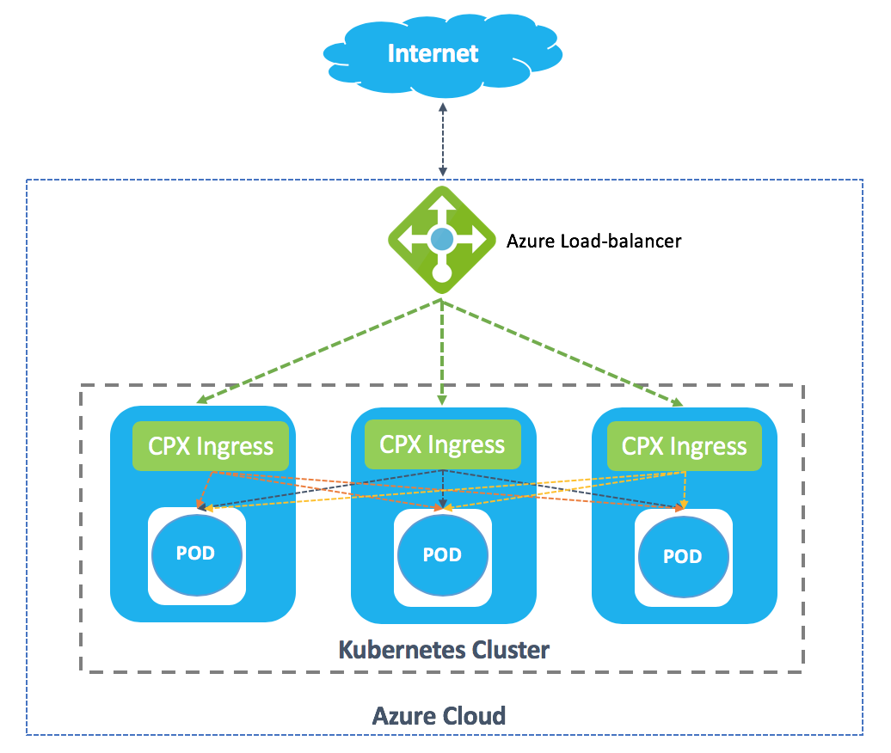

# Deploying Citrix ADC CPX as an Ingress Device in a Azure Kubernetes Service Cluster

This section explains how to deploy Citrix ADC CPX as an ingress device in a [Azure Kubernetes Service (AKS)](https://azure.microsoft.com/en-in/services/kubernetes-service/) cluster with basic networking mode (kubenet). You can also configure the Kubernetes cluster on [Azure VM](https://azure.microsoft.com/en-in/services/virtual-machines/) and then deploy Citrix ADC CPX as the ingress device.

The procedure to deploy Citrix ADC CPX for both AKS and Azure VM is the same. However, if you are configuring Kubernetes on Azure VM you need to deploy the CNI plug-in for the Kubernetes cluster.

## Prerequisites

You should complete the following tasks before performing the steps in the procedure.

-  Ensure that you have a Kubernetes cluster up and running.
-  Ensure that the AKS is configured in the basic networking mode (kubenet) and not in the advanced networking mode (Azure CNI).

!!! note "Note"
    For more information on creating a Kubernetes cluster in AKS, see [Guide to create an AKS cluster](https://github.com/citrix/citrix-k8s-ingress-controller/blob/master/deployment/azure/create-aks/README.md) .

### Deploying Citrix CPX as an Ingress Device in a AKS Cluster

Perform the following steps to deploy Citrix CPX as an ingress device in a AKS cluster.

!!! note "Note"
    In this procedure, Apache web server is used as the sample application.

1.  Deploy the required application in your Kubernetes cluster and expose it as a service in your cluster using the following command.

    ```
    kubectl create -f https://raw.githubusercontent.com/citrix/citrix-k8s-ingress-controller/master/deployment/azure/manifest/apache.yaml
    ```

    !!! note "Note"
        In this example, ``apache.yaml`` is used. You should use the specific YAML file for your application.

1.  Deploy Citrix CPX as an ingress device in the cluster using the following command.

    ```
    kubectl create -f https://raw.githubusercontent.com/citrix/citrix-k8s-ingress-controller/master/deployment/azure/manifest/standalone_cpx.yaml
    ```

1.  Create the ingress resource using the following command.

    ```
    kubectl create -f https://raw.githubusercontent.com/citrix/citrix-k8s-ingress-controller/master/deployment/azure/manifest/cpx_ingress.yaml
    ```

1.  Create a service of type LoadBalancer for accessing the Citrix CPX by using the following command.

    ```
    kubectl create -f https://raw.githubusercontent.com/citrix/citrix-k8s-ingress-controller/master/deployment/azure/manifest/cpx_service.yaml
    ```

    !!! note "Note"
        This command creates a load balancer with an external IP for receiving traffic. This is supported in kubernetes since v1.10.0.

1.  Verify the service and check whether the load balancer has created an external IP. Wait for some time if the external IP is not created.

        kubectl  get svc

    |NAME|TYPE|CLUSTER-IP|EXTERNAL-IP|PORT(S)| AGE|
    |----|----|-----|-----|----|----|
    |apache |ClusterIP|10.0.103.3|none|   80/TCP | 2m|
    |cpx-ingress |LoadBalancer |10.0.37.255 | pending |80:32258/TCP,443:32084/TCP |2m|
    |kubernetes |ClusterIP | 10.0.0.1 |none |  443/TCP | 22h |

1.  Once the  external IP for the load-balancer is available as follows, you can access your resources using the external IP for the load balancer.

        kubectl  get svc

    |NAME|TYPE|CLUSTER-IP|EXTERNAL-IP|PORT(S)|  AGE|
    |---|---|----|----|----|----|
    |apache|ClusterIP|10.0.103.3 |none|80/TCP|  3m|
    |cpx-ingress |LoadBalancer|10.0.37.255|  EXTERNAL-IP CREATED| 80:32258/TCP,443:32084/TCP |  3m|
    |kubernetes|    ClusterIP|10.0.0.1 |none| 443/TCP| 22h|

    !!! note "Note"
        The health check for the cloud load-balancer is obtained from the readinessProbe configured in the [Citrix CPX deployment yaml](https://github.com/citrix/citrix-k8s-ingress-controller/blob/master/deployment/azure/manifest/cpx_service.yaml) file. If the health check fails, you should check the readinessProbe configured for Citrix CPX.
        For more information, see [readinessProbe](https://kubernetes.io/docs/tasks/configure-pod-container/configure-liveness-readiness-probes/#define-readiness-probes) and [external Load balancer](https://kubernetes.io/docs/tasks/access-application-cluster/create-external-load-balancer/).

1.  Access the application using the following command.

    ```
    curl http://<External-ip-of-loadbalancer>/ -H 'Host: citrix-ingress.com 
    ```

## Deployment Models

You can use the following deployment solutions for deploying CPX as an ingress device in a AKS cluster.

-  Standalone Citrix CPX deployment
-  High availability Citrix CPX deployment
-  Citrix CPX per node deployment

!!! note "Note"
    For the ease of deployment, the deployment models in this section are explained with an all-in-one manifest file that combines the steps explained in the previous section. You can modify the manifest file to suit your application and configuration.

### Deploying a Standalone Citrix CPX as the Ingress Device

To deploy Citrix CPX as an Ingress device in a standalone deployment model in AKS, you should use the service type as LoadBalancer which would create a load balancer in the Azure cloud. This is supported in Kubernetes since v1.10.0.



Perform the following steps to deploy a stand alone Citrix CPX as the ingress device.

1.  Deploy a Citrix CPX ingress with inbuilt Citrix Ingress Controller in your Kubernetes cluster using the following command.

    ``` 
    kubectl create -f https://raw.githubusercontent.com/citrix/citrix-k8s-ingress-controller/master/deployment/azure/manifest/all-in-one.yaml
    ```

1. Access the application using the following command.
    ```
    curl http://<External-ip-of-loadbalancer>/ -H 'Host: citrix-ingress.com'
    ```

    !!! note "Note"
        To delete the deployment, use the following command.

            kubectl delete -f https://raw.githubusercontent.com/citrix/citrix-k8s-ingress-controller/master/deployment/azure/manifest/all-in-one.yaml

### Deploying Citrix CPX for High Availability

In the standalone deployment of Citrix CPX as the ingress, if the ingress device fails for some reason there would be a traffic outage for a few seconds. To avoid this traffic disruption, you can deploy two Citrix CPX ingress devices instead of deploying a single Citrix CPX ingress device. In such deployments, even if one Citrix CPX fails the other Citrix CPX is available to handle the traffic till the failed Citrix CPX comes up.



Perform the following steps to deploy two Citrix CPX devices for high availability.

1.  Deploy Citrix CPX ingress devices for high availability in your Kubernetes cluster by using the following command.

    ```
    kubectl create -f https://raw.githubusercontent.com/citrix/citrix-k8s-ingress-controller/master/deployment/azure/manifest/all-in-one-ha.yaml
    ```

1.  Access the application using the following command.

    ```
    curl http://<External-ip-of-loadbalancer>/ -H 'Host: citrix-ingress.com'
    ```

    !!! note "Note"
        To delete the deployment, use the following command.

            kubectl delete -f https://raw.githubusercontent.com/citrix/citrix-k8s-ingress-controller/master/deployment/azure/manifest/all-in-one-ha.yaml

### Deploying Citrix CPX per Node

In some cases where cluster nodes are added and removed from the cluster, Citrix CPX can also be deployed as daemonsets so that every node will have a Citirx CPX ingress in them. This is a much more reliable solution than deploying two Citrix CPX devices as ingress devices when the traffic is high.



Perform the followings steps to deploy Citrix CPX as a ingress device on each node in the cluster. 

1. Deploy Citrix CPX ingress device in each node of your Kubernetes cluster by using the following command.

    ```
    kubectl create -f https://raw.githubusercontent.com/citrix/citrix-k8s-ingress-controller/master/deployment/azure/manifest/all-in-one-reliable.yaml
    ```

1. Access the application by using the following command.

    ```
    curl http://<External-ip-of-loadbalancer>/ -H 'Host: citrix-ingress.com
    ```

    !!! note "Note"
        To delete the deployment, use the following command:

            kubectl delete -f https://raw.githubusercontent.com/citrix/citrix-k8s-ingress-controller/master/deployment/azure/manifest/all-in-one-reliable.yaml